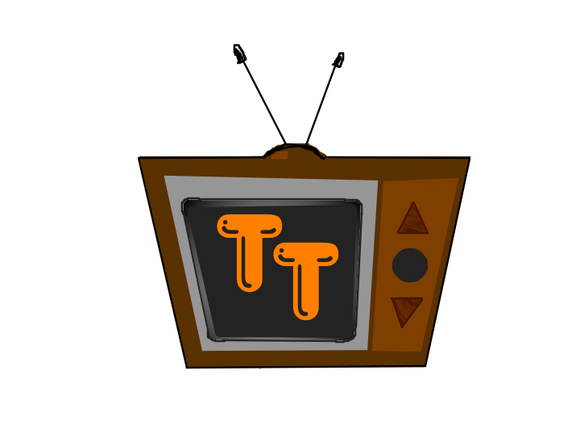

TellyGo
=====

## Description

TellyGo is an experiment in social dynamics for video chat. It emphasizes both participation (via randomly selected Telly Stars) and quality of content (no text chat, community rating).

## Participants
 * Ben: coding, layout, testing
 * Pitiya: designed logos and TellyTokens, as well as some site design and typography that we ran out of time before integrating.

## Technologies Used

 * Flex for video chat
 * RubyAMF for Flex to Rails communication
 * Rails
 * MongoDB
 
 
## RubyAMF
 
I had to patch the vendored rubyamf so it wouldn't crash when ActiveRecord isn't loaded. It doesn't currently support mongo documents, so I kept the transport to just simple data formats and collections. A good project would be to update RubyAMF to handle other ORMs.

## Security

As it's currently written, there are no protections against someone hijacking the video streams, as they are easily discoverable. To lock this behavior down, I'd like to make the red5 server talk to the rails server to determine user / channel credentials.

## Known Issues

 * __flash__ Not letting you click to Allow the site to connect to your camera? It's related to this: http://stackoverflow.com/questions/3003724/cant-click-allow-button-in-flash-on-firefox and the current workaround that I've done due to lack of time is to go the settings manager ( http://www.macromedia.com/support/documentation/en/flashplayer/help/settings_manager06.html ) and "Always allow" the site, then close the page and re-open.
 * __video__ I'd be surprised if you could get a working video chat at this point. The quality is poor, and it likely disconnects when it shouldn't. This was because I got stuck for way too long on the issue above.
 * __red5__ I wasn't able to get the red5 app working as a local streaming server, so currently I have the video chat connected to one I've previously setup. (It's very barebones, and the same example code)

## Future Features

 * TellyTokens - I think it's important in a site like this to have community feedback through voting and community moderation. The reputation system I had planned involved a currency of TellyTokens, where the typical flow would be to go to the n00b room first, and get some up votes for having your mic and camera working, then progressing to the more advance rooms where you can earn some serious reputation. As the community grows, top users will be able to create new rooms and participate in admin functionality.
 
 
 
  * Private Rooms - wouldn't this work wonderfully for scrums, where everyone's limited to a quick 15 second speech?
